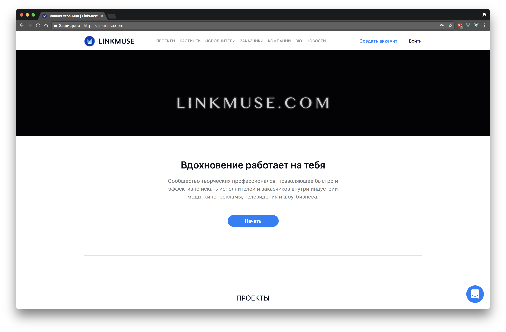

# Linkmuse-WebApp

Linkmuse clone built with Vue 2.0 + vue-router + vuex, with server-side rendering.


[Live](https://linkmuse.com/)

---

**A detailed Vue SSR guide can be found [here](https://ssr.vuejs.org).**

## Build Setup

**Requires Node.js 7+**

``` bash
# install dependencies
npm install

# build for production with minification
npm run build

# serve with hot reload at localhost:9000
npm run watch
```

[](http://standardjs.com)

## License

FSF